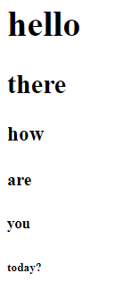

## Description
Write an HTML page that matches the screenshot provided.




To solve this problem, you will have to look up the h1 to h5 tags. A solution is provided at the bottom. Try googling "h tags w3schools" for hints

## Submission
When you are done, take a screenshot and place the screenshot in the submission subdirectory. Also, place your HTML file in the submission subdirectory. Don't forget to push your repository so that the TAs and teacher can see it.


## Reference

Your file should have this structure:

```
<html>
   <body>
      ...
   </body>
</html>
```

