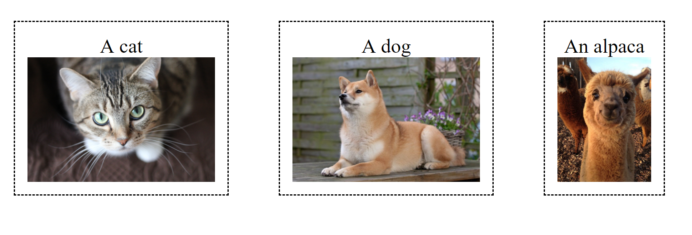

## Description
Modify the style.css file so that it recreates the following image

It does not need to be pixel perfect

## Submission
It will automatically be submitted the next time you push.

## Reference

You will need to use the display css property and set it to flex. Furthermore, you will need the following properties:

    height
    text-align
    border-style
    margin
    padding
