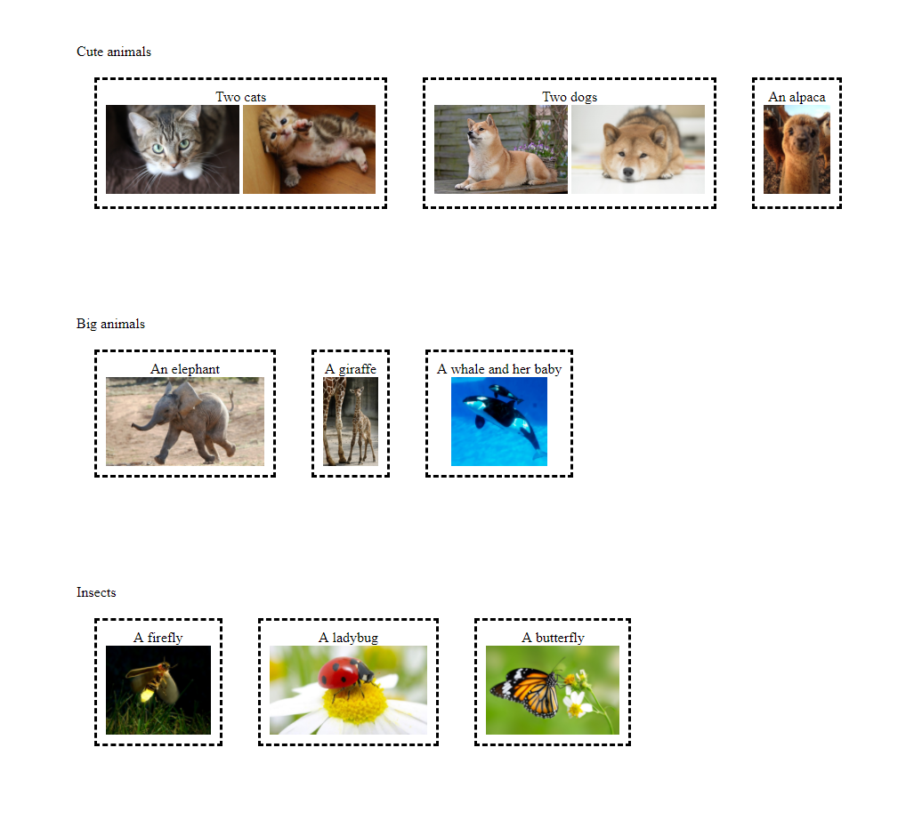

## Description
Create an HTML file and a CSS file that reproduces the following:


It does not need to be pixel perfect

## Submission
It will automatically be submitted the next time you push.

## Reference

Your HTML should have the following structure:

```
<html>
   <head>
       <link rel="stylesheet" type="text/css" href="style.css">
   </head>
   <body>
      ...
   </body>
</html>
```

Where style.css is the name of your css file.